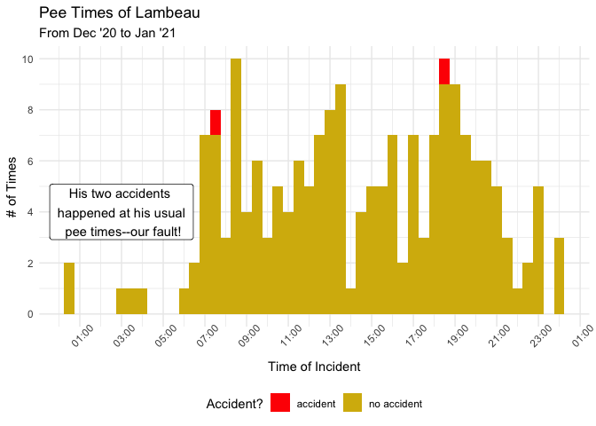
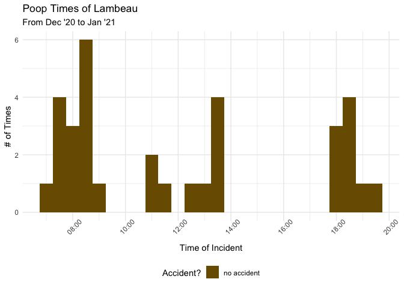

pee\_poop\_times
================
Justin Rose
1/10/2021

# Background

We recently got a new golden retriever puppy\! In our quest to avoid any
accidents inside the house (and the product of having way too much time
on our hands due to COVID), I decided to track when our little Lambeau
went pee and poop over the span of a month to see if I could try and
mitigate the amount of indoor accidents.

I started tracking this by setting up a routine through my iPhone which
would populate append a note with the exact time and type of potty break
that occured. Then I exported this data as a .csv used here.

[Here’s a link on how I set up the data collection aspect of
this\!](https://www.makeuseof.com/ways-to-quickly-start-a-new-iphone-note/#:~:text=Going%20forward%2C%20anytime%20you%20need,hit%20Done%20to%20save%20it.)

I’ve also included a screenshot of the routine I created to log
Lambeau’s poop in case you’d like to use that

# Data Cleaning

# Visuals

<!-- -->

<!-- -->

# Results

Thankfully, Lambeau was a pretty good boy and had minimal accidents
inside\! Of the two accidents that did happen, they were more our fault
than him not understanding not to go inside, as you can see they
happened during his usual pee times (most likely due to us being
distracted and not noticing his cues).

One note to mention is that during this time of his potty training, we
were taking him out roughly every hour while he was awake, as well as
immediately any time he finished a big play session. YMMV on your
capacity to do this, but this strategy combined with limiting water near
bedtime helped tremendously in avoiding any surprise accidents.

You probably don’t need to go as intense as we did with the hourly
breaks on top of creating a whole tracking workflow for your new pup’s
poops and pees (COVID quarantine will do that to you), but make sure to
take some tips from the [AKC guide on potty training your
puppy\!](https://www.akc.org/expert-advice/training/how-to-potty-train-a-puppy/)

And of course, feel free to use this repo if you’d like to visualize
your darling’s poop/pee schedule yourself\!
